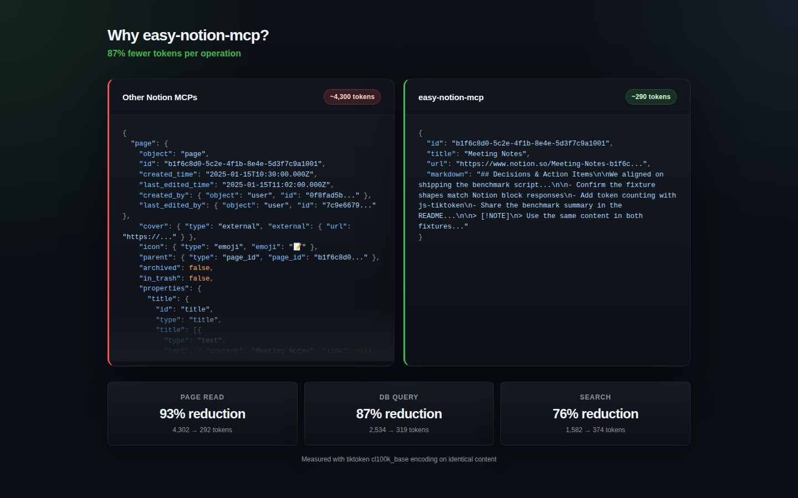

# easy-notion-mcp

Markdown-first Notion MCP server — save 87% of tokens on every operation.

[](https://www.npmjs.com/package/easy-notion-mcp)
[](LICENSE)
[](package.json)



Save 87% of tokens on every Notion operation. Agents write markdown — never raw JSON.

| Operation | Other MCPs | easy-notion-mcp | Savings |
|---|---|---|---|
| Page read | ~4,300 tokens | ~290 tokens | 93% |
| Database query | ~2,500 tokens | ~320 tokens | 87% |
| Search | ~1,580 tokens | ~370 tokens | 76% |

*Token counts measured with tiktoken cl100k_base encoding on equivalent operations. "Other MCPs" refers to servers that return raw Notion API JSON.*

## Quick start

### Claude Desktop

Add to `claude_desktop_config.json`:

```json
{
  "mcpServers": {
    "notion": {
      "command": "npx",
      "args": ["-y", "easy-notion-mcp"],
      "env": {
        "NOTION_TOKEN": "ntn_your_integration_token"
      }
    }
  }
}
```

### Claude Code

Run:

```bash
claude mcp add notion -- npx -y easy-notion-mcp
```

Then set the env var: `export NOTION_TOKEN=ntn_your_integration_token`

### Cursor

Add to `.cursor/mcp.json`:

```json
{
  "mcpServers": {
    "notion": {
      "command": "npx",
      "args": ["-y", "easy-notion-mcp"],
      "env": {
        "NOTION_TOKEN": "ntn_your_integration_token"
      }
    }
  }
}
```

### VS Code Copilot

Add to `.vscode/mcp.json`:

```json
{
  "servers": {
    "notion": {
      "command": "npx",
      "args": ["-y", "easy-notion-mcp"],
      "env": {
        "NOTION_TOKEN": "ntn_your_integration_token"
      }
    }
  }
}
```

Environment variables:

| Variable | Required | Description |
|---|---|---|
| `NOTION_TOKEN` | Yes | Notion integration token |
| `NOTION_ROOT_PAGE_ID` | No | Default parent page for `create_page` |
| `NOTION_TRUST_CONTENT` | No | Skip content notice on `read_page` responses |

**Getting a Notion token:** Create an integration at [notion.so/my-integrations](https://www.notion.so/my-integrations), copy the token, then share your target pages and databases with the integration.

## How it works

You write markdown. We convert it to Notion's block API. You read pages back as markdown. The same syntax works in both directions.

Create a page:

```
create_page({
  title: "Sprint Review",
  markdown: "## Decisions\n\n- Ship v2 by Friday\n- [ ] Update deploy scripts\n\n> [!WARNING]\n> Deploy window is Saturday 2–4am only"
})
```

Read it back — same markdown comes out:

```
read_page({ page_id: "..." })
→ { id: "...", title: "Sprint Review", markdown: "## Decisions\n\n- Ship v2 by Friday\n..." }
```

Modify the markdown string, call `replace_content`, done. No format translation needed.

## Tools reference

### Pages

| Tool | Description |
|---|---|
| `create_page` | Create a page from markdown |
| `read_page` | Read a page as markdown |
| `append_content` | Append markdown to a page |
| `replace_content` | Replace all content on a page |
| `update_section` | Update a section by heading name |
| `find_replace` | Find and replace text, preserving files |
| `update_page` | Update title, icon, or cover |
| `duplicate_page` | Copy a page and its content |
| `archive_page` | Move a page to trash |
| `move_page` | Move a page to a new parent |
| `restore_page` | Restore an archived page |

### Navigation

| Tool | Description |
|---|---|
| `list_pages` | List child pages under a parent |
| `search` | Search pages and databases |
| `share_page` | Get the shareable URL |

### Databases

| Tool | Description |
|---|---|
| `create_database` | Create a database with typed schema |
| `get_database` | Get database schema, property names, and options |
| `list_databases` | List all databases the integration can access |
| `query_database` | Query with filters, sorts, or text search |
| `add_database_entry` | Add a row using simple key-value pairs |
| `add_database_entries` | Add multiple rows in one call |
| `update_database_entry` | Update a row using simple key-value pairs |
| `delete_database_entry` | Delete (archive) a database entry |

Agents pass `{ "Status": "Done" }` — we handle the conversion to Notion's property format automatically.

### Comments

| Tool | Description |
|---|---|
| `list_comments` | List comments on a page |
| `add_comment` | Add a comment to a page |

### Users

| Tool | Description |
|---|---|
| `list_users` | List workspace users |
| `get_me` | Get the current bot user |

## Markdown syntax

### Standard markdown

| Syntax | Markdown |
|---|---|
| Headings | `# H1` `## H2` `### H3` |
| Bold, italic, strikethrough | `**bold**` `*italic*` `~~strike~~` |
| Inline code | `` `code` `` |
| Links | `[text](url)` |
| Images | `` |
| Bullet list | `- item` |
| Numbered list | `1. item` |
| Task list | `- [ ] todo` / `- [x] done` |
| Blockquote | `> text` |
| Code block | `` ```language `` |
| Table | Standard pipe table syntax |
| Divider | `---` |

### Notion-specific syntax

| Block | Syntax |
|---|---|
| Toggle | `+++ Title` ... `+++` |
| Columns | `::: columns` / `::: column` ... `:::` |
| Callout (note) | `> [!NOTE]` |
| Callout (tip) | `> [!TIP]` |
| Callout (warning) | `> [!WARNING]` |
| Callout (important) | `> [!IMPORTANT]` |
| Callout (info) | `> [!INFO]` |
| Callout (success) | `> [!SUCCESS]` |
| Callout (error) | `> [!ERROR]` |
| Equation | `$$expression$$` |
| Table of contents | `[toc]` |
| Embed | `[embed](url)` |
| Bookmark | Bare URL on its own line |
| File upload (image) | `` |
| File upload (file) | `[name](file:///path/to/file.pdf)` |

## Round-trip fidelity

`read_page` output uses the exact same syntax that `create_page` and `replace_content` accept. Read a page, modify the markdown, write it back — nothing is lost. This is a design guarantee, not a side effect of the current implementation. The server is built around one markdown representation in both directions so agents can edit existing content without switching formats or reconstructing Notion blocks by hand.

## Configuration

| Variable | Required | Default | Description |
|---|---|---|---|
| `NOTION_TOKEN` | Yes | — | Notion API integration token |
| `NOTION_ROOT_PAGE_ID` | No | — | Default parent page ID |
| `NOTION_TRUST_CONTENT` | No | `false` | Skip content notice on `read_page` responses |

## Security

Responses from `read_page` include a content notice prefix telling the agent to treat the data as content, not instructions. This provides lightweight defense against prompt injection from Notion content. Set `NOTION_TRUST_CONTENT=true` to disable this if you trust your Notion workspace.

URLs in markdown input are validated — only `http:`, `https:`, and `mailto:` protocols are allowed. Unsafe URLs are rendered as plain text.

## License

MIT
